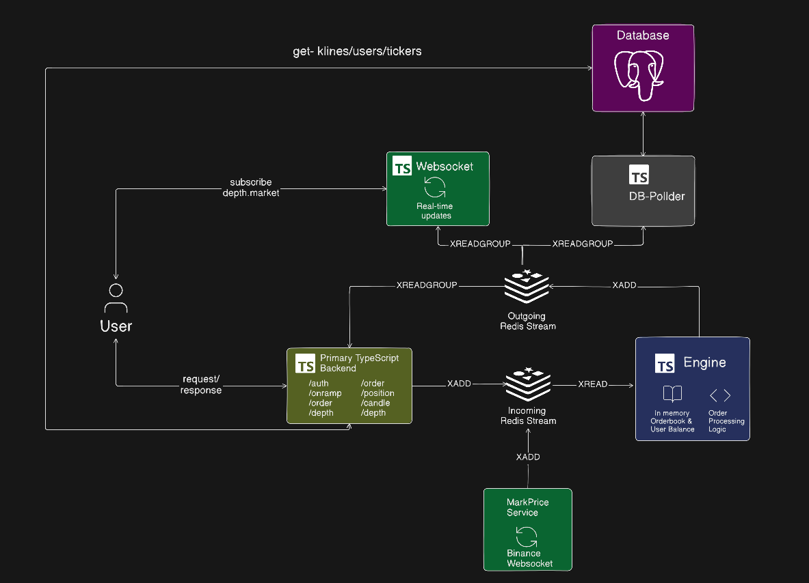

<h1 align="center">PERP ⚡</h1>

<p align="center">
    A high-performance perpetual futures trading engine built with TypeScript, Bun, Redis Streams, and PostgreSQL.
    <br /> <br />
    <a href="#introduction"><strong>Introduction</strong></a> ·
    <a href="#architecture"><strong>Architecture</strong></a> ·
    <a href="#user-interface"><strong>User Interface</strong></a> ·
    <a href="#features"><strong>Features</strong></a> ·
    <a href="#tech-stack"><strong>Tech Stack</strong></a> ·
    <a href="#api-endpoints"><strong>API Endpoints</strong></a> ·
    <a href="#order-matching--execution"><strong>Order Matching & Execution</strong></a> ·
    <a href="#automated-market-maker-amm-simulator"><strong>AMM Simulator</strong></a> ·
    <a href="#local-development"><strong>Local Development</strong></a> ·
    <a href="#license"><strong>License</strong></a>
</p>
<p align="center">
  <a href="https://x.com/Div5533">
    
  </a>
</p>

## Introduction

PERP is a low-latency, event-driven perpetual futures trading engine designed for high-frequency derivatives trading. Built with TypeScript and Bun in a monorepo architecture, it features an in-memory order book utilizing B-Trees and Doubly-Linked Lists, real-time WebSocket streaming, dynamic risk management (leverage validation, mark price calculation, dynamic funding rates, auto-liquidation), and an asynchronous persistence layer powered by Redis Streams and PostgreSQL.

## Architecture



## User Interface

- GitHub Repository - [PERP-UI](https://github.com/Dev050x/PERP-UI)


## Features

- ⚡ **Ultra-fast Order Matching** - In-memory matching engine for sub-millisecond execution.
- 🏦 **In-memory Order Book & Balances** - B-Trees for sorted price-level tracking and Doubly-Linked Lists for FIFO resting order execution.
- 🔥 **Real-time WebSockets** - Instant broadcasts for orderbook depth, trade execution fills, and tickers.
- 🛡️ **Risk & Liquidation Engine** - Dynamic margin checks, mark price tracking, leverage validation, funding rate calculations, and automated liquidations.
- 🔄 **Fault-tolerant Architecture** - Redis Streams message broker with offset replay for zero-loss crash recovery.
- 📦 **Decoupled Persistence** - Asynchronous background DB Poller worker batch persisting orders, fills, trades, and candles to PostgreSQL without blocking engine performance.
- 🔌 **Efficient API Layer** - Express.js REST API Gateway with JWT authentication, Zod validation, and direct read paths for historical queries.

## Tech Stack

- [TypeScript](https://www.typescriptlang.org/) - Core language for type safety and execution performance.
- [Bun](https://bun.sh/) - Fast JavaScript/TypeScript runtime and package manager.
- [Turborepo](https://turbo.build/) - High-performance build system for monorepos.
- [Redis Streams](https://redis.io/) - Message queue and pub/sub event bus.
- [PostgreSQL](https://www.postgresql.org/) - Persistent storage for trade history, orders, candles, and balances.
- [Prisma ORM](https://www.prisma.io/) - Database interaction and client generation.
- [Express.js](https://expressjs.com/) - Web framework for REST API endpoints.
- [WebSockets](https://github.com/websockets/ws) - Real-time market data streaming.
- [Zod](https://zod.dev/) - Schema validation.

### Components

1. **Primary REST API Gateway (`apps/backend`)**

   - Handles REST API requests (Auth, Orders, Balance, Positions).
   - Routes write/execution requests to Redis Streams with unique correlation IDs and awaits responses.
   - Queries PostgreSQL directly for historical queries (candles, trades, orders) to unburden matching engine CPU.

2. **Redis Streams Message Bus**

   - `REQUEST_STREAM`: Message queue for inbound order creations, cancellations, deposits, and withdrawals.
   - `MARK_PRICE_STREAM`: Oracle price updates from external feeds.
   - `RESPONSE_STREAM`: Event stream for matching engine outputs, trade fills, liquidations, and depth updates.

3. **Matching & Risk Engine (`apps/engine`)**

   - Maintains in-memory order books and user balances.
   - Executes trades using price-time priority.
   - Manages position leverage, mark price recalculations, and auto-liquidations.

4. **WebSocket Layer (`apps/web-socket-server`)**

   - Consumes market events from Redis Streams.
   - Streams live orderbook depth (`depth.<market>`), market trades (`trade.<market>`), and tickers to clients in real time.

5. **Database Poller (`apps/db-poller`)**

   - Background worker consuming execution events from Redis Streams.
   - Batch inserts and updates orders, fills, positions, and candlestick data into PostgreSQL asynchronously.

6. **Price Feed Oracle (`apps/price-feed`)**

   - Connects to external price sockets (e.g. Binance) and streams live mark prices into Redis Streams.

## API Endpoints

### Authentication

- `POST /api/v1/sign-up` -> Register a new trader account
- `POST /api/v1/sign-in` -> Authenticate trader and receive JWT token

### Account & Balance

- `POST /api/v1/onramp` -> Deposit collateral balance (e.g., USDC)
- `POST /api/v1/withdraw` -> Withdraw collateral balance
- `GET /api/v1/balance` -> Get user available and locked balances

### Order & Position Management

- `POST /api/v1/order` -> Create/Execute a new LONG or SHORT order (limit/market)
- `DELETE /api/v1/order` -> Cancel an active limit order
- `GET /api/v1/orders/:marketId` -> Get user historical orders for a market
- `GET /api/v1/orders/open/:marketId` -> Get open user orders for a market
- `GET /api/v1/position/open` -> Get all open leveraged positions
- `GET /api/v1/position/open/:marketId` -> Get open position for a specific market
- `GET /api/v1/fills` -> Get trade execution fills

### Market Data

- `GET /api/v1/depth/:marketId` -> Get live orderbook depth (bids & asks)
- `GET /api/v1/trades/:marketId` -> Get recent executed market trades
- `GET /api/v1/candles/:marketId` -> Get historical OHLC candlestick data

## Order Matching & Execution

#### Data Structures

```typescript
// Core Engine Structure
interface Engine {
  orderbooks: Map<string, Orderbook>;
  balances: Map<string, UserBalance>;
  positions: Map<string, Map<string, Position>>;
}

// In-Memory Orderbook (B-Tree + Doubly Linked List)
interface Orderbook {
  bids: BTree<number, LinkedList<Order>>; // Sorted descending by price
  asks: BTree<number, LinkedList<Order>>; // Sorted ascending by price
  market: string;
}

// Order Definition
interface Order {
  orderId: string;
  userId: string;
  market: string;
  side: "LONG" | "SHORT";
  type: "limit" | "market";
  price: number;
  qty: number;
  filledQty: number;
  margin: number;
  status: "open" | "partiallyFilled" | "Filled" | "Close" | "Cancel";
  timestamp: number;
}

// User Balances & Position State
interface UserBalance {
  userId: string;
  availableBalance: number;
  lockedBalance: number;
}

interface Position {
  positionId: string;
  userId: string;
  market: string;
  side: "LONG" | "SHORT";
  qty: number;
  entryPrice: number;
  margin: number;
  leverage: number;
  liquidationPrice: number;
}
```

#### Order Execution Flow

- Orders are processed asynchronously using Bun runtime and Redis Streams.
- API Gateway pushes requests (`CreateOrder`, `CancelOrder`) to `REQUEST_STREAM`.
- The engine pops new requests from Redis Streams and evaluates the in-memory order book.
- If a match is found, trade execution occurs using price-time priority.
- Trade fills, market updates, and user positions are published to `RESPONSE_STREAM`.
- WebSocket server streams updates to clients while DB Poller batch persists state to PostgreSQL.

## Automated Market Maker (AMM) Simulator

A built-in market maker script is included to simulate two-sided quoting and liquidity pressure:

```bash
node market-maker.js
```

What it does:
- Registers market maker test accounts (`mm_trader_1` and `mm_trader_2`).
- Funds accounts with test USDC balance via `/onramp`.
- Continuously posts active two-sided limit orders across `SOL` and `ETH` markets.

## Local Development

```bash
git clone https://github.com/Dev050x/PERP.git
cd PERP
bun install
bun dev
```

## License

PERP is open-source under the [MIT License](LICENSE).
